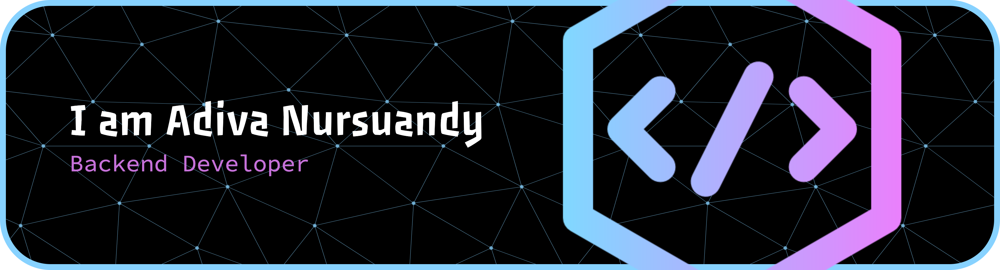

  

###

###

 

<h1 align="center">Technologies I Work With</h1>

###

  
  
  
  
  
  
  
  
  
  
  
  
  
  
  
  
  

###

  

###

 

<picture>
  <source media="(prefers-color-scheme: dark)" srcset="https://raw.githubusercontent.com/adiva2311/adiva2311/output/pacman-contribution-graph-dark.svg">
  <source media="(prefers-color-scheme: light)" srcset="https://raw.githubusercontent.com/adiva2311/adiva2311/output/pacman-contribution-graph.svg">
  
</picture>

###

&nbsp;

